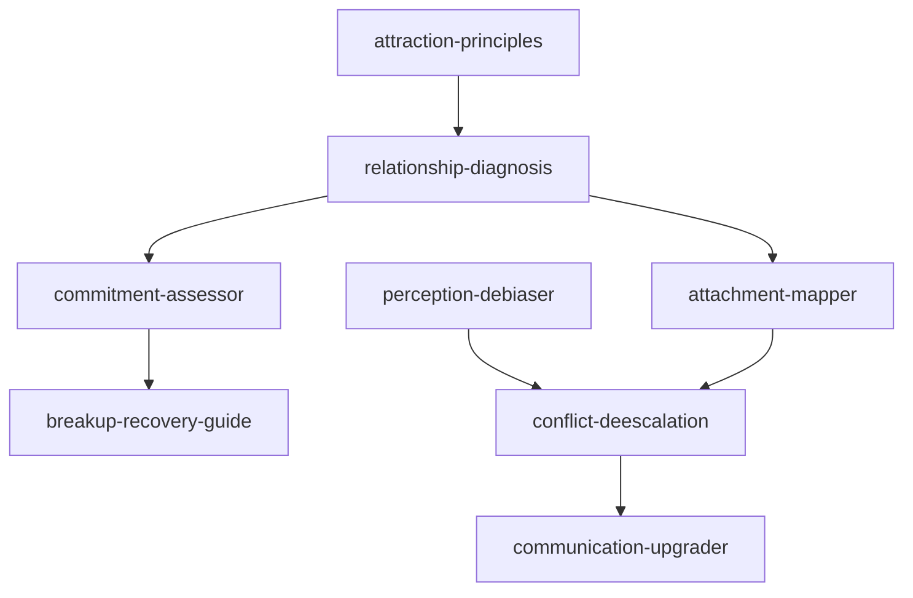

# INDEX — 《亲密关系》skill 地图

## 技能总览（8 个）

| skill | 一句话定位 | 触发关键词 |
|-------|-----------|-----------|
| relationship-diagnosis | 关系六要素体检，定位薄弱项 | 关系有问题/没那么亲密 |
| attachment-mapper | 依恋二维模型，理解自己的关系模式 | 太依赖/太冷淡/TA不回消息 |
| attraction-principles | 拆解吸引力来源与质地 | 为什么被TA吸引/合不合适 |
| perception-debiaser | 修正关系中的认知偏差与误读 | TA就是故意的/总觉得TA会背叛 |
| conflict-deescalation | 冲突降级：四骑士识别+5:1修复 | 又吵架/冷战/怎么和好 |
| communication-upgrader | 日常沟通升级：表露/表述/倾听/资本化 | 聊天越来越干/怎么表达需求 |
| commitment-assessor | 投入模型评估"该不该继续" | 该不该分手/只是习惯 |
| breakup-recovery-guide | 分手后阶段化恢复 | 走不出来/删不删TA |

## 引用图

## 使用路径建议

1. 关系刚出问题：relationship-diagnosis（体检）→ 定位薄弱项
2. 反复冲突：perception-debiaser（先去偏）→ conflict-deescalation（降级）→ communication-upgrader（重建）
3. 自我认知：attachment-mapper（理解模式）→ 针对调整
4. 纠结去留：commitment-assessor（三变量）→ 留下：maintenance / 离开：breakup-recovery-guide
